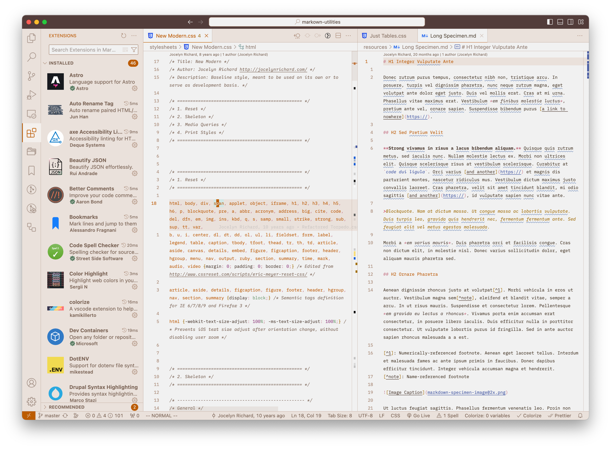
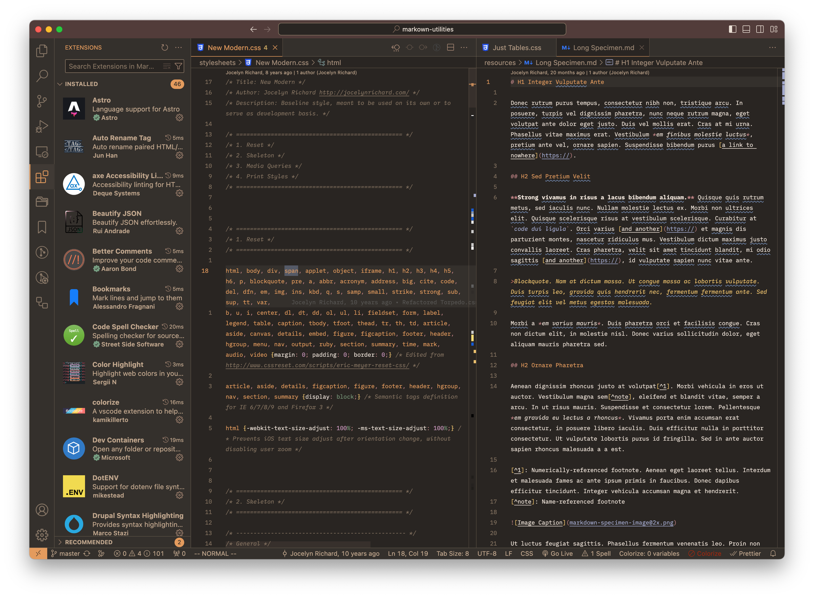

# Melange Redux: A warm VS Code theme

A slightly tweaked VS Code port of the wonderful `nvim` color scheme called [Melange](https://github.com/savq/melange-nvim) created by [savq](https://github.com/savq) 🧡.

## The theme in action

### Melange Redux: Light


### Melange Redux: Dark


## Additional information

### Auto switch between Light and Dark modes based on OS setting
> Please note: This behavior has been tested on macOS only.

After installing Melange: Redux, add the lines below to your user settings JSON, that will automatically switch between light/dark modes. This depends on having Light/Dark Appearance configured to Auto in macOS's System Settings. Things will look even better if you setup the recommended file icon theme, as described in the next section.

```JSON
  "window.autoDetectColorScheme": true,
  "workbench.preferredLightColorTheme": "Melange Redux: Light"
  "workbench.preferredLightColorTheme": "Melange Redux: Dark"
```

### File icons
I found that a good icon theme pairing for Melange Redux is the [JetBrains Icon Theme](https://marketplace.visualstudio.com/items?itemName=chadalen.vscode-jetbrains-icon-theme) by Chad Adams (id: `chadalen.vscode-jetbrains-icon-theme`).

After installing the file icon theme, make sure to add the following line to your user settings JSON, that will automatically switch to light/dark versions of itself based off the theme you're using:

```JSON
  "workbench.iconTheme": "vscode-jetbrains-icon-theme-2023-auto",
```

### Typeface
The typeface used in the screenshots is [IBM Plex](https://www.ibm.com/plex/).

### License
This project is [using an MIT license](LICENSE).
