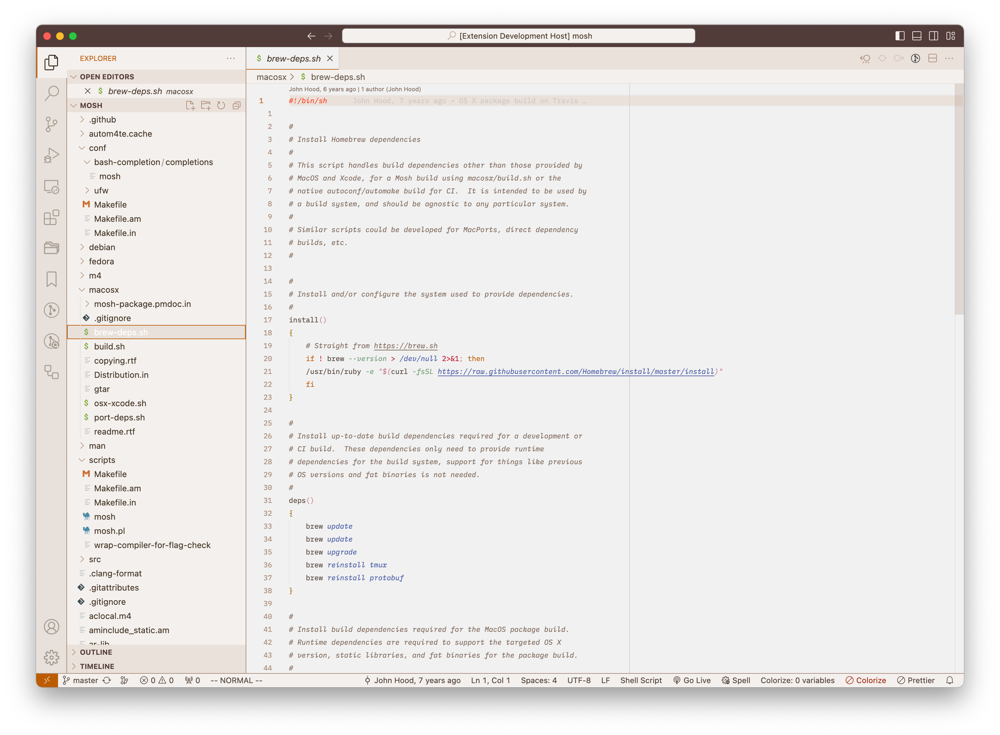

# melange-redux

A slightly tweaked port for VS Code of the wonderful nvim color scheme called [Melange](https://github.com/savq/melange-nvim) created by [savq](https://github.com/savq).

## Coming soon
- [ ] Dark Theme
